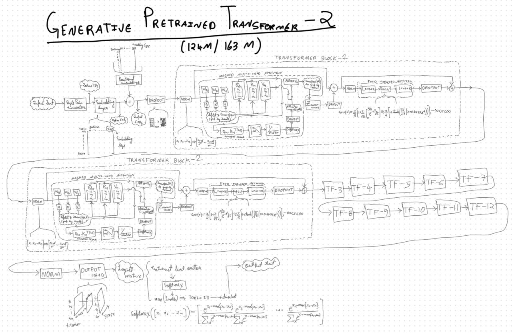

# GPT-2 From Scratch
This repo contains the custom implementation of [GPT-2](https://openai.com/index/gpt-2-1-5b-release/). This implementation was created following the playlist ["LLMs from Scratch" by Vizuara](https://youtube.com/playlist?list=PLPTV0NXA_ZSgsLAr8YCgCwhPIJNNtexWu&si=eksVKcxWNTVzJRUa). The original course has all the code in an ```ipynb``` notebook.

As I was following along the course, I have modularized the said implemenation and have also created an OpenAI weights compatible implementation (not covered in the course). In the course, the OpenAI's tensorflow weights were preprocessed and then injected into the custom implementation, whereas in my OpenAI compatible implementation (located in [compat folder](https://github.com/B4S1C-Coder/GPT-2-from-scratch/tree/main/compat)), I have used a larger (combined) K,Q,V matrix that aligns with the OpenAI weights, whereas the custom implementation (in the course) deals with this separately.


The scripts used to map the OpenAI weights (PyTorch weights downloaded from hugging face) to my OpenAI compatible implementation is [mapper_v3.py](https://github.com/B4S1C-Coder/GPT-2-from-scratch/blob/main/mapper_v3.py).



Please check the [Github Repo](https://github.com/B4S1C-Coder/GPT-2-from-scratch) for usage, utility functions etc. A self contained implementation has been provided in this Hugging Face Repo itself.

## Contents in the Repo

- ```GPT-2 Medium 355M```: OpenAI GPT-2 355M weights adapted to my OpenAI Compatible implementation.
- ```GPT-2 Medium 355M Instruction-tuned```: GPT-2 355M finetuned on ```instruction-data.json``` originally taken from [rasbt/LLMs-from-scratch](https://github.com/rasbt/LLMs-from-scratch), only 1 epoch.
- ```GPT-2 Small 124M```: OpenAI GPT-2 124M weights adapted to my OpenAI Compatible implementation.
- ```GPT-2 Small 163M Pre-trained from scratch```: GPT-2 163M pre-trained entirely from scratch on ```The Verdict by Edith Wharton``` taken from [rasbt/LLMs-from-scratch](https://github.com/rasbt/LLMs-from-scratch). 163M since, no weights have been re-used (unlike OpenAI).
- ```GPT-2 Small 124M```: OpenAI GPT-2 124M weights adapted to my OpenAI Compatible implementation which contains a two class classification head for spam/not spam classification.
- ```GPT-2 Medium 355M Reasoning```: Fintuned on ```AM-DeepSeek-R1-Distilled-1.4M``` 1K samples, 3 epochs
- ```custom_gpt2_impl.py```: Self contained PyTorch implementation that uses these weights. Contains no utility functions and uses ```tiktoken.get_encoding('gpt2')``` as the tokenizer.

## Regarding Datasets

### Acknowledgment

This project uses a sample 1K JSONL file from the **1.4 Million Open-Source Distilled Reasoning Dataset** by Zhao et al. (2025).

> Zhao, H., Wang, H., Peng, Y., Zhao, S., Tian, X., Chen, S., Ji, Y., & Li, X. (2025).  
> *1.4 Million Open-Source Distilled Reasoning Dataset to Empower Large Language Model Training.*  
> [arXiv:2503.19633](https://arxiv.org/abs/2503.19633)

This dataset has been taken from [HuggingFace](https://huggingface.co/datasets/a-m-team/AM-DeepSeek-R1-Distilled-1.4M).
